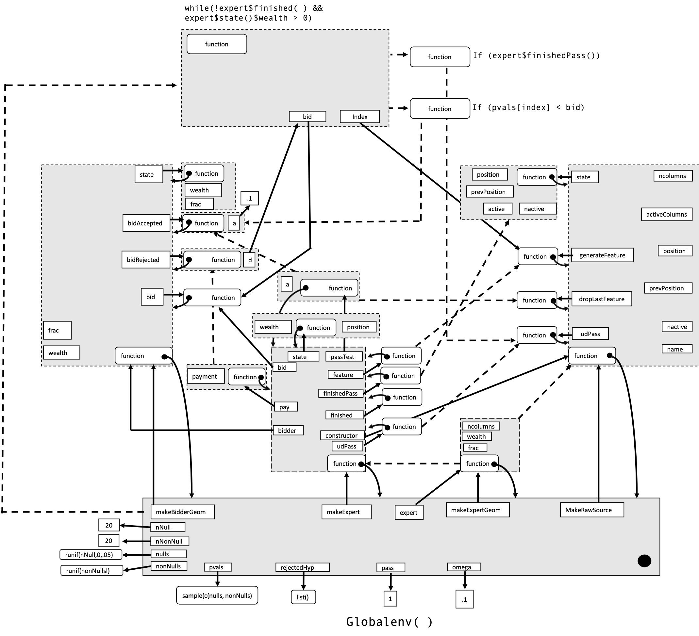

```{r setup, include=FALSE}
library(knitr)
library(tidyverse)
opts_chunk$set(echo = TRUE,
               collapse = FALSE,
               comment = "",
               strip.white = TRUE,
               warning = FALSE,
               messages = FALSE,
               out.width = "70%",
               fig.align = "center")
theme_set(theme_light())
```

# Explanations and drawings {.tabset .tabset-fade .tabset-pills}

> Explain what every function does.  Importantly,  you need to include the environment in which the function is bound and the other variables in this environment.  Alternatively,  you  could  draw  a  picture  of  all  of  the  environments  which  enclose  functions which are bound in the expert list.  Both capture the same information (though the picture is more succinct)

## makeBidderGeom

This function constructs a list containing four functions. One of the functions (state) stores a list with the current state. We have a bidAccepted function which increments the wealth value in the state, the bidRejected which decreases the wealth value and the bid function which implements the geometric behavior of the bid.

```{r eval=F}
makeBidderGeom = function(wealth=.05, frac = .5) {
  list( 
    state = function() { 
      list(
        wealth = wealth,
        frac   = frac
      ) 
    },
    bidAccepted = function(a) { wealth <<- wealth + a },
    bidRejected = function(d) { wealth <<- wealth - d },
    bid = function()  { ifelse(wealth > .0001, wealth*frac, wealth) }
  )
}
```

## makeBidderConst

See makeBidderGeom, almost the same besides the bid function which has a different (constant) bidding behavior and the state.

```{r eval=F}
makeBidderConst = function(wealth=.05, const=.01) {
  list( 
    state = function() { 
      list(
        wealth  = wealth,
        const   = const
      ) 
    },
    bidAccepted = function(a) { wealth <<- wealth + a },
    bidRejected = function(d) { wealth <<- wealth - d },
    bid = function()  { ifelse(wealth >= const, const, wealth) }  
  )
}
```

## makeRawSource

This constructor handles the position of the hypotheses and coordinates where the test is conducted.

```{r eval=F}
makeRawSource <- function(ncolumns) {
  activeColumns  = 0:ncolumns
  position       = ncolumns
  prevPosition   = NA
  nactive        = ncolumns
  
  list(
    name = "Marginal",
    state = function() { 
      list(
        position     = position, 
        prevPosition = prevPosition,
        active       = activeColumns,
        nactive      = sum(!is.na(activeColumns[-1]))
      )
    },
    generateFeature = function() { 
      prevPosition  <<- position
      position      <<- max(activeColumns[activeColumns < position], na.rm=T)
      return(prevPosition) 
    },
    dropLastFeature = function() { activeColumns[prevPosition+1] <<- NA },
    udPass = function() {
      position <<- max(activeColumns, na.rm=T)
      prevPosition <<- NA
    }
  )
}
```

## makeExpert

Takes a bidder and a constructor as input and outputs a list which is used to additionally handle the bidding and other important functions for the hypothesis testing.

```{r eval=F}
makeExpert <- function (bidder, constructor) {
  list(
    name         = "Geom",
    bidder       = bidder,
    constructor  = constructor,
    state        = function() { 
      list(
        wealth   = bidder$state()$wealth,
        position = constructor$state()$position
      )
    },
    bid          = function() { bidder$bid() },
    feature      = function() { constructor$generateFeature() },
    finishedPass = function() { constructor$state()$position == 0 },
    finished     = function() { constructor$state()$nactive == 0 },
    passTest     = function(a) {
      bidder$bidAccepted(a)
      constructor$dropLastFeature() 
    },
    pay          = function(payment) {
      bidder$bidRejected(payment)
    },
    udPass       = function() { constructor$udPass() }
  )
}
```

## makeExpertGeom

Takes `ncolumns` as mandatory input and outputs a new expert.

```{r eval=F}
makeExpertGeom <- function(ncolumns, wealth=.05, frac=.5) {
  makeExpert(
    makeBidderGeom(wealth, frac),
    makeRawSource(ncolumns)
  )
}
```

## environmentDrawing

```{r}

```


# Comment the code

> Comment the code thoroughly. After part 1, you should understand how the code works.  Now comment it to help explain it to others.  Essentially every line should be commented. Remember, you are not explaining what the code does,  e.g.,  for line 42,  “ifelse checks the condition, bids wealth*frac if it holds, otherwise wealth.” Instead, explain why things are done as they are, e.g., “ifelse statement ensures termination by eventually bidding remaining wealth”. Note that some things are worth explaining a bit of the how. For example, line 95, “+1 accounts for the zero at the beginning of the activeColumns vector”.

```{r results="hide"}
# Creates a bidder with a geometric bidding strategy, therefore a fractional input can be specified. Also the wealth of the bidder is stored here..
makeBidderGeom = function(wealth=.05, frac = .5) {
  # Function outputs a list
  list( 
    # Stores the wealth and frac in a function (see question 3)
    state = function() { 
      # state outputs a list
      list(
        # outputs the (updated) wealth value of the makeBidder env
        wealth = wealth,
        # outputs the (updated) frac value of the makeBidder env
        frac   = frac
      ) 
    },
    # When a bid was accepted it takes the value of the bid and increments wealth by this value
    bidAccepted = function(a) { wealth <<- wealth + a },
    # Opposite of the function above (decreases the wealth)
    bidRejected = function(d) { wealth <<- wealth - d },
    # Consitutes the bidding strategy of the bidder, ensures eventual termination of the hypothesis test
    bid = function()  { ifelse(wealth > .0001, wealth*frac, wealth) }
  )
}

# Creates a bidder with a constant bidding strategy
makeBidderConst = function(wealth=.05, const=.01) {
  # Function outputs a list
  list( 
    # Stores the wealth and frac in a function (see question 3)
    state = function() { 
      # state outputs a list
      list(
        # outputs the (updated) wealth value of the makeBidder env
        wealth  = wealth,
        # outputs the (updated) frac value of the makeBidder env
        const   = const
      ) 
    },
    # When a bid was accepted it takes the value of the bid and increments wealth (value of makeBidder env) by this value
    bidAccepted = function(a) { wealth <<- wealth + a },
    # Opposite of the function above (decreases the wealth)
    bidRejected = function(d) { wealth <<- wealth - d },
    # Constitutes the bidding strategy of the bidder, ensures eventual termination of the hypothesis test
    bid = function()  { ifelse(wealth >= const, const, wealth) }  
  )
}

# Constructor which takes ncolumns (length of all possible tests) as input
makeRawSource <- function(ncolumns) {
  # Vector of positions we could test and a safety zero position
  activeColumns  = 0:ncolumns
  # Current position of the test
  position       = ncolumns
  # Previous position of the test
  prevPosition   = NA
  # Number of remaining tests
  nactive        = ncolumns
  
  # function outputs a list
  list(
    # Name
    name = "Marginal",
    # Stores various position parameters (see question 3)
    state = function() {
      # Function outputs a list
      list(
        # Current position of the test
        position     = position, 
        # Previous position of the test
        prevPosition = prevPosition,
        # Vector of positions we could test and a safety zero position
        active       = activeColumns,
        # Number of remaining tests
        nactive      = sum(!is.na(activeColumns[-1]))
      )
    },
    # Outputs currents position and updates the position
    generateFeature = function() {
      # Updates previous with output prevPosition
      prevPosition  <<- position
      # Moves position from current down to the next position (non NA) 
      position      <<- max(activeColumns[activeColumns < position], na.rm=T)
      # Outputs current Position
      return(prevPosition) 
    },
    # Function to keep track of the non-rejected values (called when hypothesis is rejected)
    dropLastFeature = function() { 
      # Decrement the activeColumns
      activeColumns[prevPosition+1] <<- NA 
      },
    # Resets the position values after a passed test
    udPass = function() {
      # 
      position <<- max(activeColumns, na.rm=T)
      # Resets prevPosition
      prevPosition <<- NA
    }
  )
}

# MakeExpert takes the bidder and the constructor and coordinates the two. Both have to be given. 
makeExpert <- function (bidder, constructor) {
  
# It creates a list, containing the name ("Geom"), the bidder, constructor and 8 functions. 
  
  list(
    # Creating a name variable
    name         = "Geom",
    # Bidder is the given bidder (in our case: makeBidderGeom or makeBidderConst)
    bidder       = bidder,
    # Constructor is the given constructor (in our case: makeRawSource)
    constructor  = constructor,
    
    # Keeps track of current wealth and position. Wealth is taken 
    # The bidder, while the current position is taken from the constructor. 
    state        = function() { 
      list(
        #takes the wealth from the bidder
        wealth   = bidder$state()$wealth,
        #takes the position from the constructor
        position = constructor$state()$position
      )
    },
    
    # Calls the bid function from (in our case) makeBidder(Geom/Const)
    # bid creates a "shortcut" to the bid function of bidder. We can thus call 
    # bid right away without having to call bidder first
    bid          = function() { bidder$bid() },
    
    # Shortcut to the generateFeature function from (in our case) makeRawSource
    feature      = function() { constructor$generateFeature() },
    
    # checks if position in state of makeRawSource is 0. Needed later as a 
    # condition for udPass 
    finishedPass = function() { constructor$state()$position == 0 },
    
    # checks if nactive is 0. If True algorithm is terminated
    finished     = function() { constructor$state()$nactive == 0 },
    
    # Shortcut to bidAccepted and dropLastFeature. If pvalue is rejected,
    # algorithm will skip it in further iterations.
    passTest     = function(a) {
      # calls the bidAccepted function to increase the wealth
      bidder$bidAccepted(a)
      # calls the dropLastFeature 
      constructor$dropLastFeature() 
    },
    
    # Reduce wealth by bid amount. Shortcut.
    pay          = function(payment) {bidder$bidRejected(payment) },
    
    
    # Shortcut. If current position is 0 the algorithm restarts at the 
    # non-rejected pvalue with the highest index. 
    udPass       = function() { constructor$udPass() }
  )
}

# Shortcut to makeExpert.
makeExpertGeom <- function(ncolumns, wealth=.05, frac=.5) {
# this function takes the number of columns, and optional the wealth and frac. 
# it calls the makeExpert function above, with 
  makeExpert(
  # bidder being the bidder made by the makeBidderGeom function. 
  # The input values for wealth and frac are passed
    makeBidderGeom(wealth, frac),
  # constructor is made by the makeRawSource function. 
  # The input value of ncolumns is passed on. 
    makeRawSource(ncolumns)
  )
}

# setting example data
# make experiment repeatable
seed = 421232 
set.seed(seed) 

# Defines number of hypotheses tested
nNull = 20; nNonNull = 20

# vector of (pseudo)randomly generated values between 0 and 1. 
# Null hypothesis is true
nulls = runif(nNull)

# vector of (pseudo)randomly generated values between 0 and .05. 
# Null hypothesis false
nonNulls = runif(nNonNull, 0, .05)

# Permuting pvalues
pvals = sample(c(nulls, nonNulls)) 

# Set wealth, called "omega"
omega = .1

# making an expert, with ncolumns = length(pvals), wealth and frac
# expert is assigned makeExpertGeom() object.
expert = makeExpertGeom(length(pvals), wealth=omega, frac=.1)

# making an empty list for the rejectedHyp
# Updates every time hypothesis is rejected.
rejectedHyp = list()

# setting pass to 1
# Updates as algorithm cycles through pvalues.
pass = 1

# algorithm continues as long as there are remaining hypotheses to test and
# wealth is not depleted
while (!expert$finished() && expert$state()$wealth > 0) {
  # Index of current hypothesis test
  index = expert$feature()
  # Returns current bid
  bid = expert$bidder$bid()
  # Decreases wealth by amount of bid
  expert$pay(bid)
  # Tests if hypothesis can be rejected
  if (pvals[index] < bid) {
    # Adjusts wealth by omega
    expert$passTest(omega)
    # Adds index of rejected hypothesis to list rejectedHyp as a list element
    rejectedHyp[[1+length(rejectedHyp)]] = index
  }
  # Checks if there are remaining tests
  if(expert$finishedPass()) {
    # Resets position from 0 to highest index in the constructor
    expert$udPass()
    # Tracks number of current iteration.
    pass = pass+1
  }
}
rejectedHyp; pass
pvals[unlist(rejectedHyp)]
```

# Why a list?

> The state function returns the values of the private variables.  Why is this a function that returns a list and not just a list of the values of the private variables?

If it was a list the values wouldn't update and would only return the values at the initialization of the parent function. Let's take our bidder function and see how that works practice.

```{r}
makeBidderGeomNoFun = function(wealth=.05, frac = .5) {
  list( 
    state = list(
      wealth = wealth,
      frac   = frac
    ), 
    bidAccepted = function(a) { wealth <<- wealth + a },
    bidRejected = function(d) { wealth <<- wealth - d },
    bid = function()  { ifelse(wealth > .0001, wealth*frac, wealth) }
  )
}
```
Again, the only difference to our old bidder function is that the state is now a list instead of a function. 

```{r}
# Set number of iterations for while loop
setn = 5
# With function
testA <- makeBidderGeom()
# Without function
testB <- makeBidderGeomNoFun()
# Returns list of outputs. 
state <- 
  function() {
    list(
      hasFunction = testA$state()$wealth,
      hasList = testB$state$wealth
    )
  }

state()
```
As we can see we have the same starting values. Now let's take a loop which calls the `bidAccept` function and see what happens to the `state`.

```{r}
while(setn >= 0){
  testA$bidAccepted(100) 
  testB$bidAccepted(100) 
  setn = setn-1
}

state()
```

We find that bidderFunction with a list as a state doesn't update and therefore would be unusable in a program.

# Multiple experts {.tabset .tabset-fade .tabset-pills}

> Generalize the code to use multiple experts (store the experts in a list).  While the code should be general, test it using two experts; one expert should use a geometric bidder and the other should use the constant bidder. Start each expert with wealth = omega/2.  The expert with the maximum bid “wins”, and gets to perform its test.  Note that each expert has private bidder and constructor objects (why?).  Only use one makeExpert function (you should pass it an argument for which bidder function to use).

## Code

```{r}
makeMultiExpert <- function(..., ncolumns, wealth=.05) {
  output <- list()
  for (i in seq_along(list(...))) {
    output[[i]] <- makeExpert(
      list(...)[[i]](wealth),
      makeRawSource(ncolumns)
    )
  }
  output
}
```

To keep the code as simple and as general as possible we opted to use partial function application in regard to the bidder options problem. The other option would be to check which function was supplied and then apply the right option but this would require hardcoding every single bidder and bidder option and wouldn't be general in our opinion.

There are many functional packages that provide partial function application but we went with purrr since we used the tidyverse in our class.

## Example

There are still a few choices to make. We can decide if we want to terminate the condition if one expert is finished or keep on going. We decided on the latter. We also tried to keep it as general as possible, i.e. to be able to use more than two experts. In two parts we decided against in for the sake of clarity. _(see comment in code)_

```{r}
expertConst = partial(makeBidderConst, const=.05)
expertGeom  = partial(makeBidderGeom,  frac=.1)
expert = makeMultiExpert(expertConst, expertGeom, ncolumns=length(pvals), wealth=omega/2)
names(expert) <- c("const","geom")
expert$const$name = "Const"

for(i in seq_along(expert)){
  expert[[i]]$rejectedHyp <- list()
  expert[[i]]$pass <- 1
}

while (!reduce(map(expert, function(x) x$finished()), function(x,y) x || y) 
       && reduce(map(expert, function(x) x$state()$wealth > 0), function(x,y) x || y)) 
  {

  # 2 lines below only work for two experts
  bid = list(const = expert$const$bidder$bid(), geom = expert$geom$bidder$bid())
  ifelse(bid$const > bid$geom, wstr <- "const", wstr <- "geom")

  winner <- expert[[wstr]]
  index = winner$feature()
  maxBid <- max(unlist(bid))

  winner$pay(maxBid)

  if (pvals[index] < maxBid) {
    winner$passTest(omega)
    winner$rejectedHyp[[1+length(winner$rejectedHyp)]] <- index
  }
  if (winner$finishedPass()) {
    winner$udPass()
    winner$pass <- winner$pass+1
  }
  expert[[wstr]] <- winner
  
  #print(paste("winner:", wstr , "index:", index, "wealth const:", expert$const$state()$wealth, "wealth geom: ", expert$geom$state()$wealth, "bid: ", maxBid, "p: ", pvals[min(unlist(index))]))
}

for(i in seq_along(expert)){
  print(paste(expert[[i]]$name,expert[[i]]$rejectedHyp, expert[[i]]$pass,pvals[unlist(expert[[i]]$rejectedHyp)]))
}
```

# Same Bidder

>  Suppose I start the two experts from part 4 with the same constructor object.  How does this set of experts behave compared to the ones in part 4?  How does this help you design bidding strategies?

```{r}
makeMultiExpertSC <- function(..., ncolumns, wealth=.05) {
  sc <- makeRawSource(ncolumns)
  output <- list()
  for (i in seq_along(list(...))) {
    output[[i]] <- makeExpert(
      list(...)[[i]](wealth),
      sc
    )
  }
  output
}

expertConstSC = partial(makeBidderConst, const=.1)
expertGeomSC  = partial(makeBidderGeom,  frac=.1)
expertSC = makeMultiExpert(expertConstSC, expertGeomSC, ncolumns=length(pvals), wealth=omega/2)
names(expertSC) <- c("const","geom")
```

# Single wealth object

> Make  both  experts  from  the  part  d  use  a  single  wealth  object.   This will require you to create a separate wealth object that is passed to both of the bidders, and modify the bidder objects to change the wealth object appropriately.

The main idea for our approach was to get rid of the wealth in the state function and rely on a wealth value in the global environment. Both `bidAccepted` and `bidRejected` functions already used the superassignment operator and it was therefore not necessary to change that aspect of the code.

```{r}
# no more wealth in state
makeBidderGeomSW = function(frac = .5) {
  list( 
    state = function() { list(frac = frac) },
    bidAccepted = function(a) { wealth <<- wealth + a },
    bidRejected = function(d) { wealth <<- wealth - d },
    bid = function()  { ifelse(wealth > .0001, wealth*frac, wealth) }
  )
}

# no more wealth in state
makeBidderConstSW = function(const=.01) {
  list( 
    state = function() { list(const = const) },
    bidAccepted = function(a) { wealth <<- wealth + a },
    bidRejected = function(d) { wealth <<- wealth - d },
    bid = function()  { ifelse(wealth >= const, const, wealth) }  
  )
}

# no more wealth in state
makeExpertSW <- function (bidder, constructor) {
  list(
    name         = "Geom",
    bidder       = bidder,
    constructor  = constructor,
    state        = function() { list(position = constructor$state()$position) },
    bid          = function() { bidder$bid() },
    feature      = function() { constructor$generateFeature() },
    finishedPass = function() { constructor$state()$position == 0 },
    finished     = function() { constructor$state()$nactive == 0 },
    passTest     = function(a) {
      bidder$bidAccepted(a)
      constructor$dropLastFeature() 
    },
    pay          = function(payment) {
      bidder$bidRejected(payment)
    },
    udPass       = function() { constructor$udPass() }
  )
}

# partial function application is not necessary anymore
# we can simply pass the initialized function to our function
makeMultiExpertSW <- function(..., ncolumns) {
  output <- list()
  for (i in seq_along(list(...))) {
    output[[i]] <- makeExpert(
      list(...)[[i]],
      makeRawSource(ncolumns)
    )
  }
  output
}

# wealth here
wealth = omega/2
expertConstSW = makeBidderConstSW(const=.05)
expertGeomSW  = makeBidderGeomSW(frac=.1)

expertSW = makeMultiExpertSW(expertConstSW, expertGeomSW, ncolumns=length(pvals))
names(expertSW) <- c("const","geom")
expertSW$const$name = "Const"

for(i in seq_along(expertSW)){
  expertSW[[i]]$rejectedHyp <- list()
  expertSW[[i]]$pass <- 1
}

# adjusted control flow
while (!reduce(map(expert, function(x) x$finished()), function(x,y) x || y) && wealth > 0) {
  bid = list(const = expertSW$const$bidder$bid(), geom = expertSW$geom$bidder$bid())

  ifelse(bid$const > bid$geom, wstr <- "const", wstr <- "geom")

  winner <- expertSW[[wstr]]
  index = winner$feature()
  maxBid <- max(unlist(bid))


  winner$pay(maxBid)

  if (pvals[index] < maxBid) {
    winner$passTest(omega)
    winner$rejectedHyp[[1+length(winner$rejectedHyp)]] <- index
  }
  if (winner$finishedPass()) {
    winner$udPass()
    winner$pass <- winner$pass+1
  }
  expertSW[[wstr]] <- winner

  #print(paste("winner:",wstr ,"index:", index, "wealth:", wealth, "bid:", maxBid, "p:", pvals[min(unlist(index))]))
}

for(i in seq_along(expertSW)){
  print(paste(expertSW[[i]]$name,expertSW[[i]]$rejectedHyp, expertSW[[i]]$pass,pvals[unlist(expertSW[[i]]$rejectedHyp)]))
}
```
